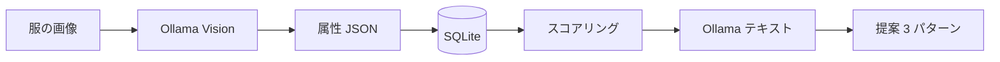

# vlm-outfit-refiner


手持ちの服の写真をローカル VLM で属性化し、シチュエーションに合わせたコーデ案を**無難 / きれいめ / 攻め**の 3 通り、理由付きで返す CLI。外部クラウド API は使いません（Ollama 前提）。

---

## 要点

| 項目 | 内容 |
|------|------|
| 言語 | Python 3.10+ |
| 推論 | [Ollama](https://ollama.com) + Vision モデル（例: `qwen2.5vl:7b`） |
| 永続化 | SQLite（既定 `data/outfit.db`） |
| 入出力 | 主に **JSON**（登録・提案とも） |



---

## 前提チェック

1. Ollama が起動している（`ollama serve` または常駐サービス）
2. Vision 用モデルを `ollama pull` 済み
3. コーデ提案は **tops / bottoms / shoes 各1点以上** 登録されていること（服が分かる写真のほうがカテゴリ推定が安定しやすい）

---

## クイックスタート

```bash
cd vlm-outfit-refiner
python3 -m venv .venv
source .venv/bin/activate   # Windows: .venv\Scripts\activate
pip install -r requirements.txt
ollama pull qwen2.5vl:7b
```

```bash
# 服を登録（1枚ずつ。成功すると JSON が標準出力に出る）
python main.py add ./photos/shirt.jpg
python main.py add ./photos/pants.jpg
python main.py add ./photos/sneakers.jpg

# 提案（対話式は引数なし / 非対話は下記）
python main.py recommend --situation カフェ --temp 0 --style きれいめ

# VLM の誤分類を直す
python main.py list
python main.py reclassify 2          # 同じ画像ファイルで属性を取り直し（Ollama 利用）
python main.py edit 2 --category bottoms --color ネイビー   # 手で直す（Ollama 不要）
```

`recommend` の `--temp`: `0` か未指定＝普通、`1`＝暑い、`2`＝寒い。漢字（`暑い` 等）も可。成功時は `ok` と `proposals`（最大 3 件）の JSON。

---

## コマンド早見

| コマンド | 役割 |
|----------|------|
| `python main.py add <画像パス>` | VLM で属性抽出 → DB 保存。同一内容（SHA-256）は重複登録しない |
| `python main.py add-batch <dir>` | フォルダ内の画像をまとめて登録（`--recursive` / `--limit` / `--verbose`） |
| `python main.py reclassify <id>` | DB にある `image_path` のファイルを読み直し、VLM で属性を再抽出して上書き（`file_hash` も更新） |
| `python main.py edit <id> --category …` など | 登録済み 1 件の属性を手直し。`--style` / `--season` は**カンマ区切り**（Ollama 不要） |
| `python main.py portrait <photo>` | 背景/トリミング/色味でプロフィール写真っぽく整える（ポーズ/体型は変えない） |
| `python main.py recommend` | シチュエーション等を尋ね、3 パターン＋理由を JSON 出力 |
| `python main.py preset list` | 想定ユーザー（ペルソナ）プリセットの一覧 |
| `python main.py dogfood` | プリセット全部でまとめて `recommend`（比較用JSONを出力） |
| `python main.py list` | 登録アイテム一覧（JSON） |

グローバルオプション: `--db <path>`（DB 指定）、`--ollama <URL>`、`--model <name>`（いずれも省略時は下表と既定値）。

---

## 環境変数

| 変数 | 既定 | 意味 |
|------|------|------|
| `OLLAMA_HOST` | `http://127.0.0.1:11434` | Ollama のベース URL |
| `OLLAMA_VISION_MODEL` | `qwen2.5vl:7b` | 属性抽出・解説文の既定モデル |
| `OLLAMA_TEXT_MODEL` | 未設定時は上と同じ | 解説だけ別モデルにしたい場合 |

`--model` / `--ollama` はこれらより優先されます。

---

## テスト（開発用）

```bash
python3 -m venv .venv
source .venv/bin/activate
pip install -r requirements-dev.txt
# 環境に pytest のグローバルプラグイン（ROS 等）が入っていると衝突することがあるので:
PYTEST_DISABLE_PLUGIN_AUTOLOAD=1 pytest
```

`tests/` に SQLite と `recommender.narrate_outfit` のモックを使ったユニットテストがあります（Ollama 不要）。

---

## ローカルUI（Streamlit）


```bash
python3 -m venv .venv
source .venv/bin/activate
pip install -r requirements-dev.txt
streamlit run app.py
```

UI から `add` / `list` / `edit` / `reclassify` / `recommend` を一通り触れます（内部は同じモジュールを呼び出すだけの薄いUI）。

---

## 登録される属性（スキーマの目安）

`add` の `attributes` に含まれる想定の形:

```json
{
  "category": "tops|bottoms|outer|shoes|bag|accessory",
  "color": "日本語の短い表現",
  "style": ["タグ", "…"],
  "season": ["春", "夏", "秋", "冬"],
  "formality": 3,
  "fit": "日本語",
  "notes": "1行の補足"
}
```

`formality` は 1（カジュアル）〜5（フォーマル）の想定。

---

## レコメンドの中身（MVP）

- 候補は **tops × bottoms × shoes** の直積から生成し、シチュエーション由来のフォーマリティ、スタイル語、気温感に応じた季節の近さでスコア
- トップスとボトムの**同系色**には簡易ペナルティ
- 無難 / きれいめ / 攻めで重みを変え、**別の組**を取りに行く（枚数が少ないと同じ着合わせになることもある）
- 最後に Ollama で `summary` / `reason` / `tips` を JSON で生成

`temp_feel` が「寒い」で DB に `outer` があると、可能な範囲でアウターを 1 点割り当てます。

---

## トラブルシューティング

| 症状 | まず見る所 |
|------|------------|
| `Connection refused` / Ollama に繋がらない | `ollama serve` か OS の Ollama サービス起動、ファイアウォール |
| カテゴリが偏る（例: 全部 tops） | 無地や抽象画に近い画像は不安定。全身・衣類が写る写真向き |
| `recommend` が服の点数不足で失敗 | `list` で `tops` / `bottoms` / `shoes` の有無を確認 |
| 応答が遅い / メモリを食う | モデルサイズを下げる、同時に動かすアプリを減らす |
| `reclassify` が「画像ファイルがありません」 | `image_path` がずれている。写真をそのパスに戻すか、`edit` で直す前提でデータだけ修正 |

---

## ドッグフーディングのすすめ（おすすめ運用）

最短で価値が出る流れはこれです。

1. **まず10枚だけ登録**（トップス/ボトムス/靴が最低1枚ずつ入るように）
2. `recommend` を回して、ズレたら `reclassify` → だめなら `edit`
3. 登録を増やす（週末にまとめて）

フォルダ一括登録（例）:

```bash
python main.py add-batch ~/Pictures/wardrobe --recursive --limit 30
python main.py list
python main.py recommend
```

`--verbose` を付けると、各ファイルの結果（dedup/失敗理由）を JSON に含めます。

ペルソナ切り替えでまとめて検証（例）:

```bash
python main.py preset list
python main.py dogfood --limit 5        # LLMなしで高速（既定）
python main.py dogfood --summary --limit 5  # 比較向けサマリ（結果を軽量化）
python main.py dogfood --llm --limit 2  # 理由文生成も回す（遅い）
python main.py recommend --preset office_clean
```

---

## 次にやると良いこと

優先度は好みで調整してください。

1. **品質** — プロンプト `prompts/*.md` のチューニング（撮影・照明でも変わるので `reclassify` と併用）
2. **拡張 UI** — `typer` + Rich、または小さな **Streamlit/Gradio** から同モジュールを import
3. **テスト** — さらに `main.py` の統合テストや、VLM 応答パースの境界ケースなど（現状は `tests/test_db.py` / `tests/test_recommender.py`）
4. **パフォーマンス** — 組み合わせ爆発時のサンプリング、カテゴリ内の事前絞り込み
5. **移動・バックアップ** — 画像の実体を `data/` 下にコピーしてパス壊れを防ぐ、DB の JSON エクスポート

**実装済み**: `edit`（手修正）、`reclassify`（VLM で取り直し）、`pytest` 用の DB / レコメンドの基本テスト（`narrate_outfit` はモック）。

---

## 免責

学習・自己利用向けの MVP です。モデル出力は誤ることがあります。実際の着用や購入の判断は、必ず自分の目で確認してください。
